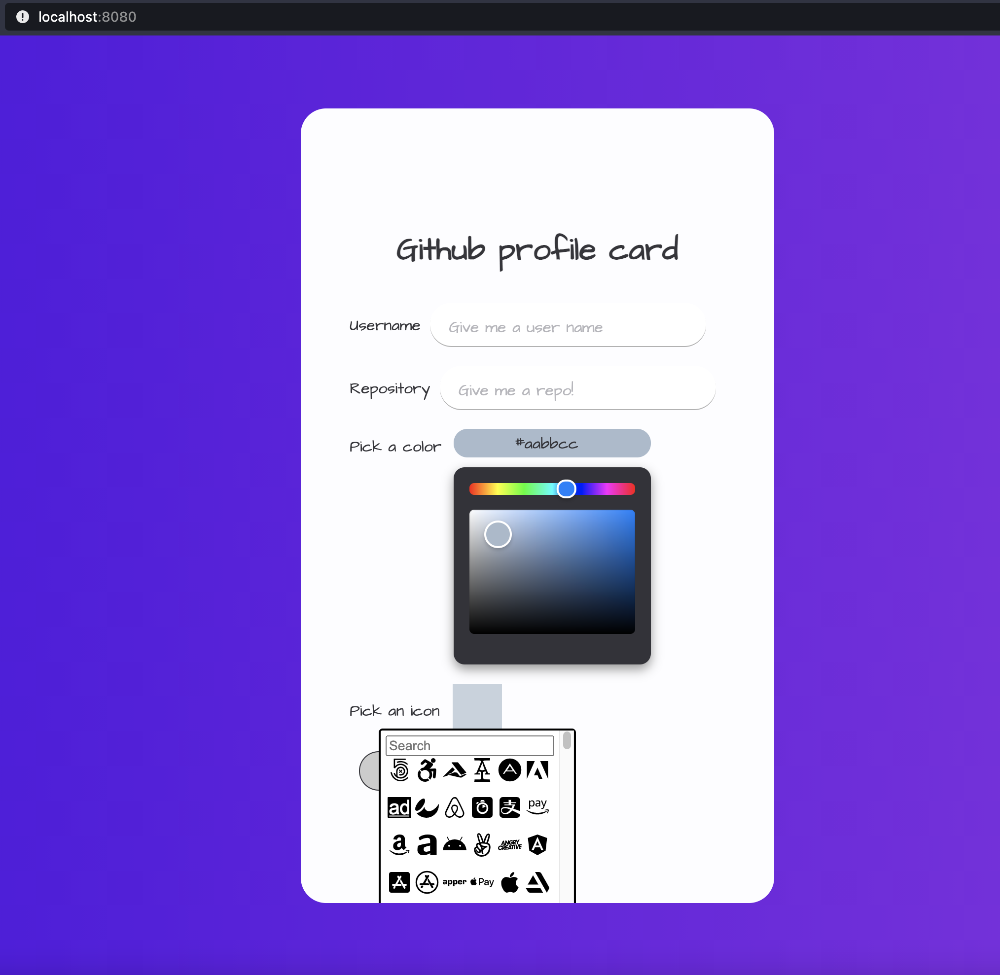
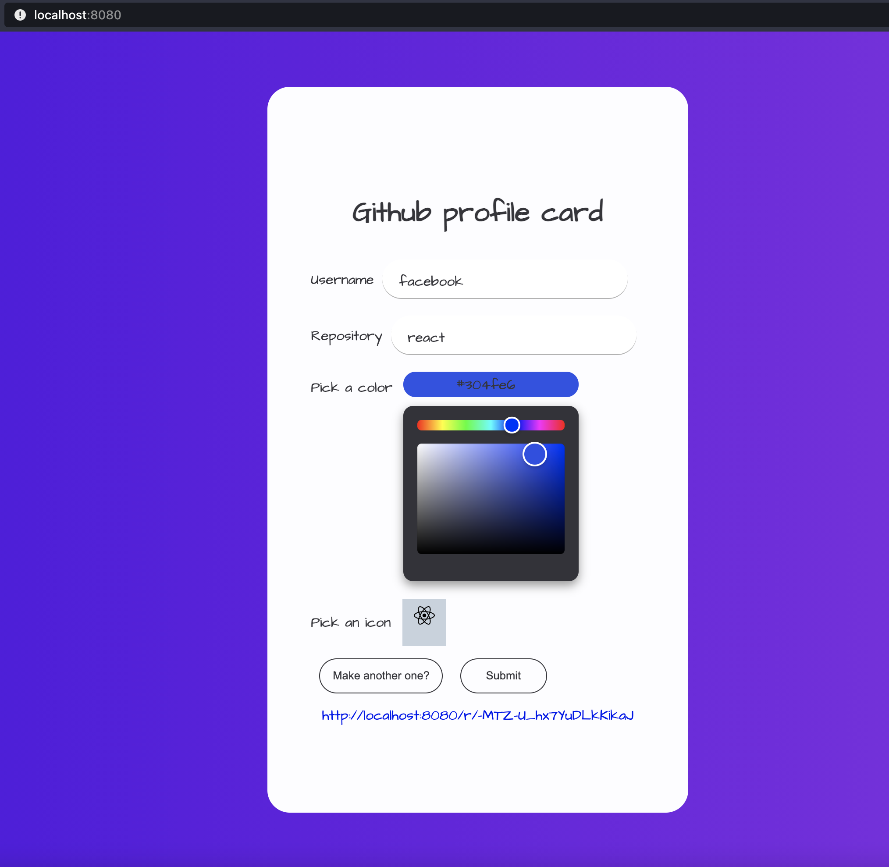
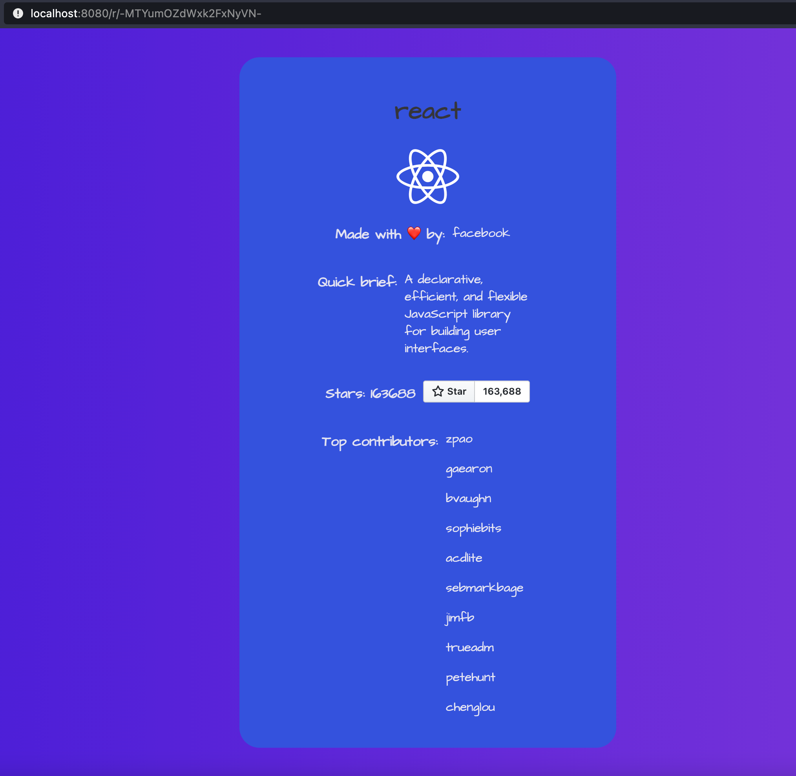

# GitCard :rocket: :zap: :fire:

[](https://twitter.com/hamza_hsn)
[](https://travis-ci.org/hamzahsn/superchat-frontend-challenge)

## Introduction

GitCard is a small app made with :love: with Typescript, React, and bundled with webpack, which was basically a challenge made by the vikings of superchat, and I accepted it with a spirit of a warrior :axe:

## Quick start

Just close this repo into your own repository and then let the magic start :fireworks: :tada:

```bash
git clone git@github.com:hamzahsn/superchat-frontend-challenge.git
cd superchat-frontend-challenge
npm install
npm run start:profile
```

After this, you should get an open navigator with the link: `http://localhost:8080/` otherwise you can just go to that :link:

and then you will have a beautiful card:



then once you have put a username and a repository and chose a color and picked a color and submitted then you will have your magic link :sparkles:



And then you can navigate to it and you can see your magic card:



## Commands:

| Command                 |        description        |
| ----------------------- | :-----------------------: |
| `npm run lint`          |       lint project        |
| `npm run lint:fix`      |  fix lint of the project  |
| `npm run style:lint`    | fix styles of the project |
| `npm run start:profile` |       start the app       |
| `npm run build:profile` |       build the app       |
| `npm run test`          |    run test of the app    |
| `npm run test:watch`    |      watch jest test      |
| `npm run test:coverage` |     run test coverage     |
| `npm run test:update`   |    run coverage update    |

## folder structure

I got inspired from the atomic structure to create this project, where I have put all my small components such as inputs, buttons, typography...inside Atoms folder under component, and for my small container I user Organisms for that which will hold my card basically, and I have added another page folder to contain every page that have a separate route.

## Deployment application

This application is deployed by [github Pages](https://pages.github.com/) where you can see it when you navigate to this link: [GitCard](https://hamzahsn.github.io/superchat-frontend-challenge/) .

## Like it?

Then just :star: it :wink:
